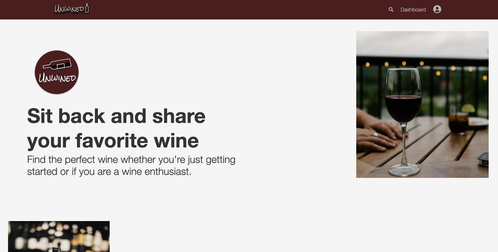
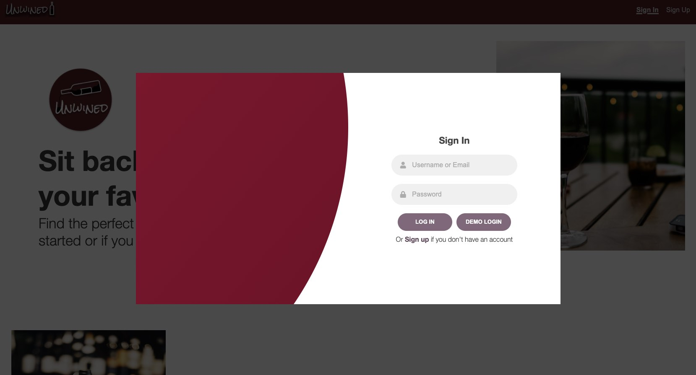
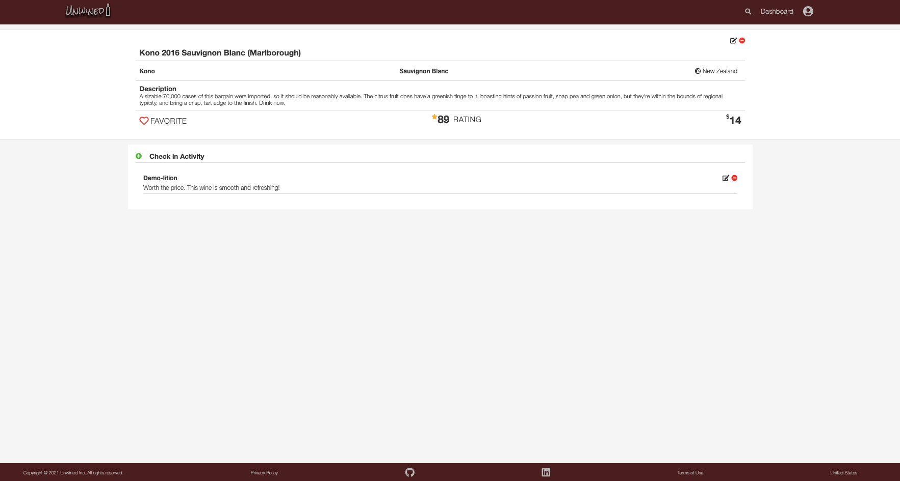
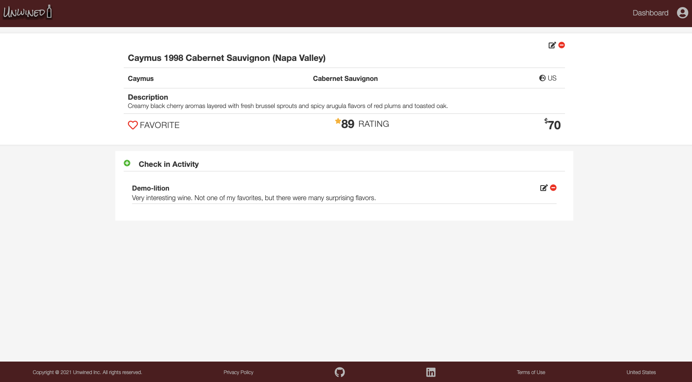
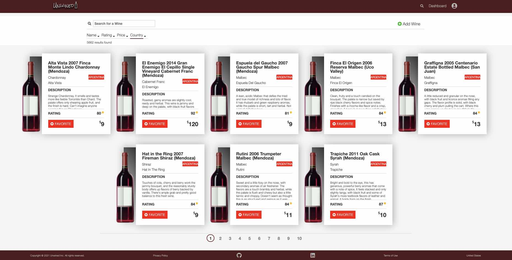
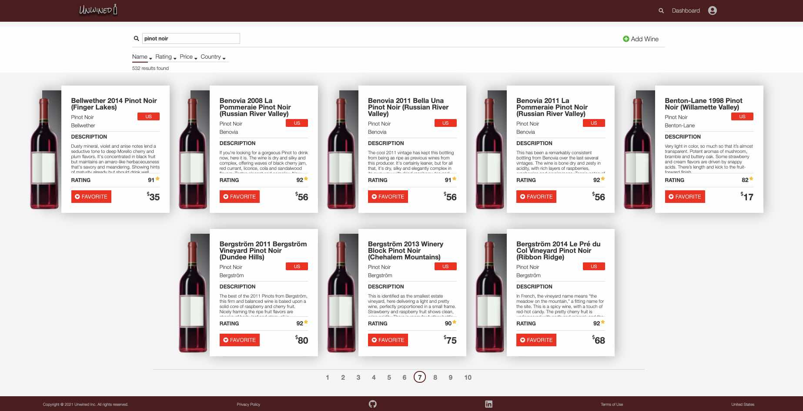
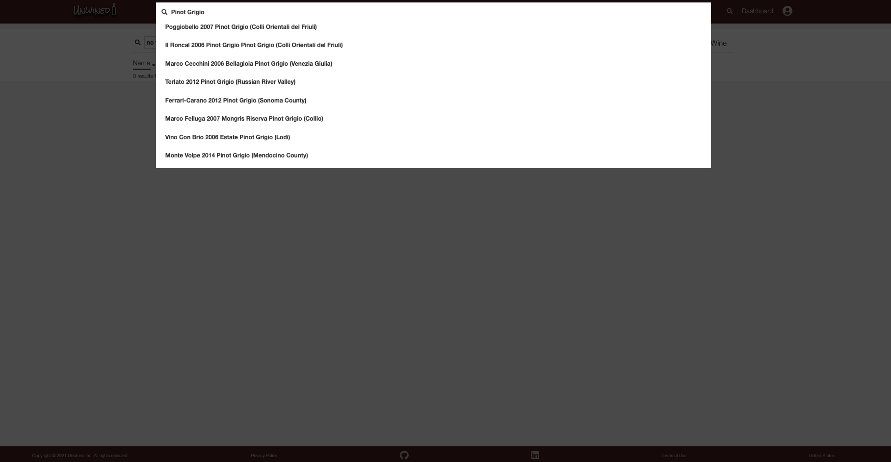

<p align='center'>
  
</p>

# Unwined
Unwined is a wine rating App that assists users to discover and rate new wines. It is a fullstack React App made with a Redux state manager and a backend using Node/Express, Sequelize, and PostgresSQL. 

* View the <a href='https://unwined-wine-app.herokuapp.com/'>Unwined</a> App Live
* It is modeled after the <a href='https://untappd.com/'>Untappd</a> App
* There are over 5k wines, 3k wineries and 300 wine types seeded in the database

* Reference to the Unwined <a href='https://www.github.com/nicopierson/unwined/wiki'>Wiki Docs</a>

| Table of Contents |
| ----------------- |
| 1. [Features](#features) |
| 2. [Installation](#installation) |
| 3. [Technical Implementation Details](#technical-implementation-details) |
| 4. [Future Features](#future-features) |
| 5. [Contact](#contact) |
| 6. [Special Thanks](#special-thanks) |

## Technologies
* <a href="https://developer.mozilla.org/en-US/docs/Web/JavaScript"></a>
* <a href="https://www.postgresql.org/"></a>
* <a href="https://sequelize.org/"></a>
* <a href="https://www.npmjs.com/package/express"></a>
* <a href="https://nodejs.org/"></a>
* <a href="https://reactjs.org/"></a>
* <a href="https://redux.js.org/"></a>
* <a href="https://developer.mozilla.org/en-US/docs/Web/CSS"></a>

## Features

### Splash Page
Unwined home page invites user and describes features of site


### Sign In and Sign Up



### Wine Detail
Shows the details of a single wine and users are able to edit or delete wines or add Reviews


### Edit Wine
Form to edit wine in the database


### Review
Users can add reviews for a wine


### Review In Edit and Delete
Comment to edit is highlighted in blue and options to save or cancel changes


### Dashboard
Page to discover and search for new wines, or add a new one


### Add Wine
Add a new wine to the database


### Pagination
User has clicked the 7th page link, which is highlighted below


### Search Modal
Modal renders search results below as user types input


## Installation
To build/run project locally, please follow these steps:

1. Clone this repository

```javascript
git clone https://github.com/nicopierson/unwined.git
```

2. Install npm dependencies for both the `/frontend` and `/backend`

```javascript
npm install
```

3. In the `/backend` directory, create a `.env` based on the `.env.example` with proper settings
4. Setup your PostgreSQL user, password and database and ensure it matches your `.env` file
5. Run migrations and seeds in the `/backend`

```javascript
npx dotenv sequelize db:create
npx dotenv sequelize db:migrate
npx dotenv sequelize db:seed:all
```

6. Start both the backend and frontend

```javascript
npm start
```

## Technical Implementation Details

### CSS Transitions
The first goal was to find a method to dynamically unmount a component from an event e.g. click or an input change. After searching and experimenting, I discovered the `CSSTransition` component from the `react-transition-group` package. 

First the state is declared and references are made:

```javascript
const [toggleForm, setToggleForm] = useState(false);
const [ref, setRef] = useState(React.createRef());

useEffect(() => {
  setRef(React.createRef())
}, [toggleForm]);
```

Then one `CSSTransition` component holds the `WineDetailPage`, and another the `WineForm` as a child. The `WineDetailPage` unmounts when a user clicks the `Edit` button, and afterwards the `WineForm` component mounts. These components will swap again when a user clicks the `Cancel` button in the `WineForm`. 

Integrating these components with `Transition` components allow dynamic mounting based on a toggle state such as `toggleForm` shown below:

```javascript
return (
    <>
      <CSSTransition
        in={!toggleForm}
        timeout={800}
        classNames='wine_detail'
        nodeRef={ref}
        unmountOnExit
      >
        <>
          <WineDetailPage 
            ref={ref}
            setToggleForm={setToggleForm}
          />
          <CheckIn />
        </>
      </CSSTransition>
      <CSSTransition
        in={toggleForm}
        timeout={800}
        classNames='wine_edit_form'
        unmountOnExit  
        nodeRef={ref}
      >
        <WineForm 
          ref={ref} 
          setToggleForm={setToggleForm}
          method={'PUT'}
          title='Edit Wine'
        />
      </CSSTransition>
    </>
  );
```

### Search
In order to access all of the wines, the search feature was vital. At first, I created separate routes accepting parameter variables to search based on name, rating, and price. Unfortunately, it became messy and hard to read. As a result, I opted to use a query string from the `useLocation` React hook instead of sending search parameters with `useParams` hook. 

Below the route to query a wine from sequelize, uses the query string to extract variables for the search string, order, attribute, and page number:

```javascript
router.get(
  '/',
  asyncHandler(async (req, res, next) => {
    let { search, page, attribute, order: orders } = req.query;
    if (!page) page = 1;
    const offset = limitPerPage * (page - 1);

    let { where, order } = createQueryOptions(attribute, orders);

    if (search) {
      where = {
        ...where,
        name: {
          [Op.iLike]: `%${search}%`
        }
      };
    }

    const wines = await Wine.findAndCountAll({
      offset: offset,
      limit: limitPerPage,
      where: where ? where : {},
      order: order ? order : [],
    });

    return res.json({ ...wines, offset })
  })
);
```

### Pagination
It is also excessive to show more than 5k wines on a page, which can lead to excessive overhead and a slower response time. 

In response, I created a Pagination component to calculate the offset number per page, and passed as a query string to the api route:

```javascript
const { search: searchString } = useLocation();
let { attribute, order, search } = queryString.parse(searchString);
if (!attribute) attribute = 'name';
if (!order) order = 'desc'; 

let numberOfPages = Math.ceil(numberOfResults / itemsPerPage);
if (numberOfPages > pageLimit) numberOfPages = pageLimit;

if (!numberOfPages) return null;
const pageNumbers = [...Array(numberOfPages).keys()];
```

## Future Features

1. __Feed Page__ - show most recent reviews

2. __Favorite__ - like wines and add to feed page

3. __Friends__ - add friends and display their reviews on feed page

4. __Wineries__ - CRUD for wineries

## Contact

* [Email](mailto:nicogpt@gmail.com)
* [LinkedIn](https://www.linkedin.com/in/nico-pierson/)
* [AngelList]()
* [Github](https://github.com/nicopierson)

## Special Thanks
* Fellow peers who have given me support and community: [Andrew](https://github.com/andru17urdna), [Henry](https://github.com/hnrywltn), [Pierre](https://github.com/TheGuilbotine), [Lema](https://github.com/lemlooma), [Meagan](https://github.com/meagan13), [Simon](https://github.com/Simonvargas), [Michelle](https://github.com/michellekontoff), and [John](https://github.com/Jomix-13)
* Mentors who have given me their time and effort: [JD](https://github.com/jdrichardstech), [Peter](https://github.com/Lazytangent), [Thanh](https://github.com/tawnthanh), [William](https://github.com/WJVincent), and [Javier](https://github.com/javiermortiz) 
* My partner: Thayse
