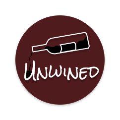
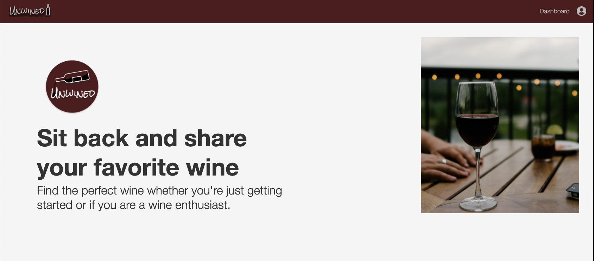
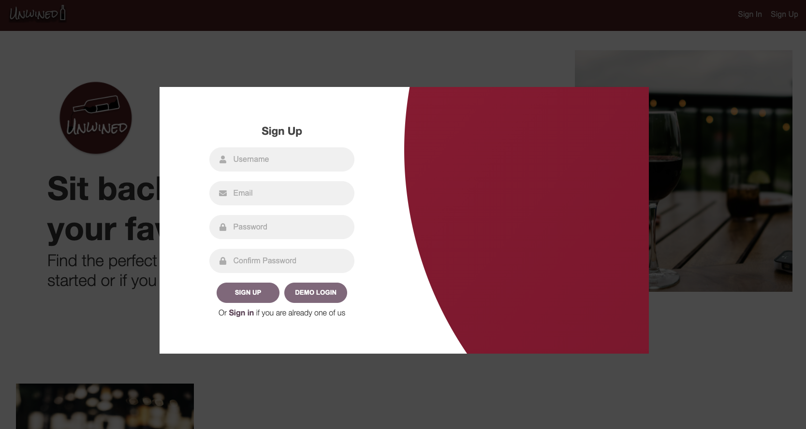
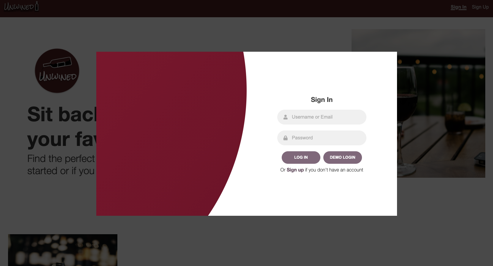
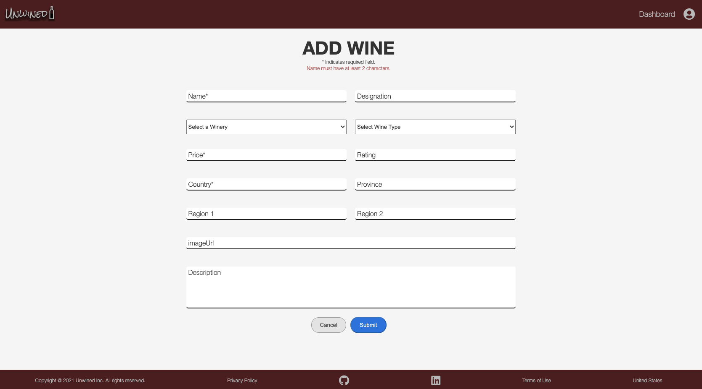
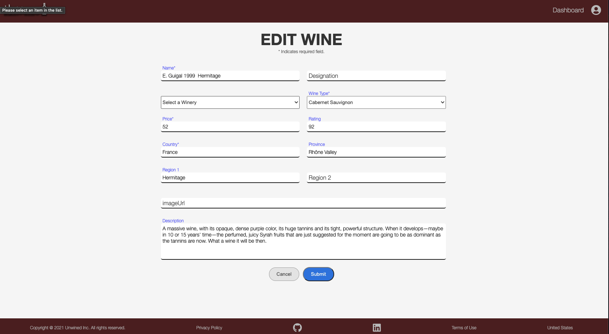
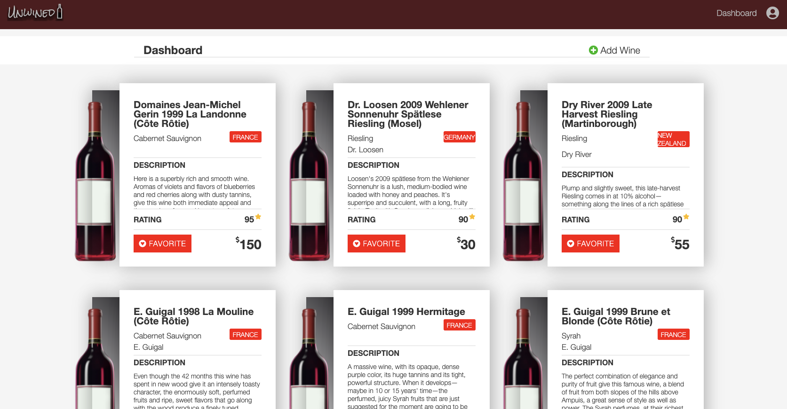
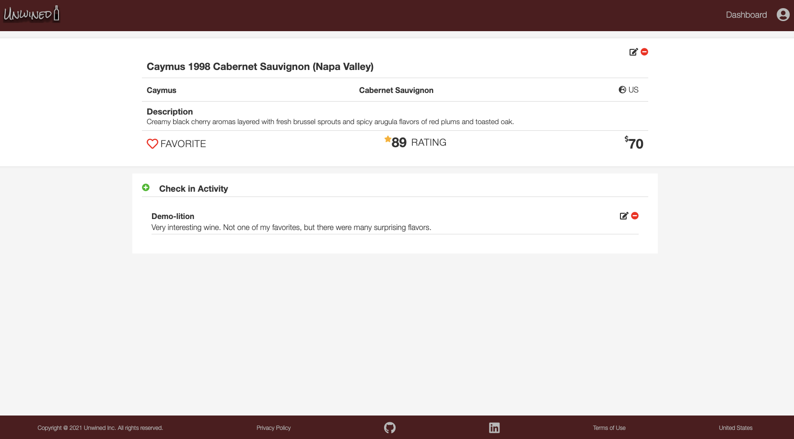
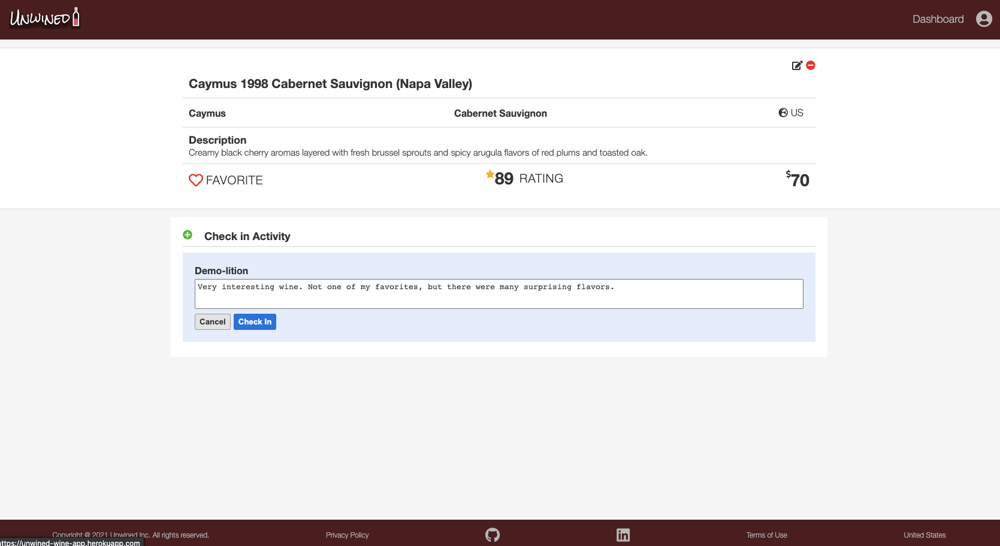

  

# Unwined
Find the perfect wine whether you're just getting started or if you are a wine enthusiast.

* Unwined is a platform for wine enthusiasts to discover and share their favorite wine. It is modeled after the Untappd app.
* Reference to the <a href='https://www.github.com/nicopierson/unwined/wiki'>Unwined wiki docs</a>
* View the <a href='https://unwined-wine-app.herokuapp.com/'>Unwined App</a> Live

## Table of Contents

  * [Features](#features)
  * [Contact](#contact)
  * [Special Thanks](#special-thanks)
  
## Features

### Splash Page

### Sign In and Sign Up

### Add Wine

### Edit Wine

### Dashboard

### Check In

### Check In Edit and Delete

## Contact

* [Email](mailto:nicogpt@gmail.com)
* [LinkedIn](https://www.linkedin.com/in/nico-pierson/)
* [AngelList]()
* [Github](https://github.com/nicopierson)

## Special Thanks
* Fellow peers who have given me support and community: [Andrew](https://github.com/andru17urdna), [Henry](https://github.com/hnrywltn), [Pierre](https://github.com/TheGuilbotine), [Lema](https://github.com/lemlooma), [Meagan](https://github.com/meagan13), [Simon](https://github.com/Simonvargas), [Michelle](https://github.com/michellekontoff), and [John](https://github.com/Jomix-13)
* Mentors who have given me their time and effort: [JD](https://github.com/jdrichardstech), [Peter](https://github.com/Lazytangent), [Thanh](https://github.com/tawnthanh), [William](https://github.com/WJVincent), and [Javier](https://github.com/javiermortiz) 
* My partner and QA Tester: Thayse
